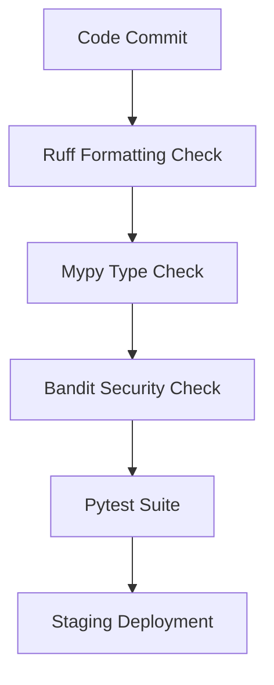

# NES-200 — Python Engineering Standards

---

## 1. Metadata
- **ID:** NES-200
- **Title:** Python Engineering Standards
- **Status:** L3 - Enterprise
- **Version:** 1.0.0
- **Authors:** NeelStack Backend Platform Team
- **Created:** 2026-07-04
- **Last Updated:** 2026-07-04

## 2. Executive Summary
This document defines the official, non-negotiable Python engineering standards for all backend services at NeelStack. It covers style guidelines, formatting rules, dependency management policies, and type-checking enforcement to ensure code quality and system maintainability.

## 3. Purpose
Standardizing Python development across all product teams reduces cognitive load, accelerates onboarding, ensures security compliance, and ensures unified tooling across our service-oriented architecture.

## 4. Scope
This standard applies to all Python codebases, services, serverless functions, scripts, and libraries built or maintained by NeelStack.

## 5. Audience
This standard is intended for all software engineers, architects, security reviewers, and QA engineers working with Python at NeelStack.

## 6. Background
Python is our primary language for backend service development, data engineering pipelines, and AI/LLM integrations. Establishing strict standards prevents common dynamic typing issues and keeps codebases clean.

## 7. Architecture
Python backend services at NeelStack follow the Clean Architecture paradigm (see LAW-010). All external boundaries (databases, HTTP interfaces, events) must be separated from core domain business logic.

## 8. Standards

### Formatter and Linter
- **Linter & Formatter**: Use `ruff` for linting, code formatting, and import sorting.
- **Line Length**: Max line length is **100 characters**.
- **Quote Style**: Double quotes `"` preferred for string literals.

### Type Hints
- **Enforcement**: Strict type hints are required for all function arguments, return types, and variables.
- **Type Checker**: `mypy` must pass in strict mode (`--strict`).

## 9. Rules

### Dependency Management
- All services must use `pyproject.toml` with dependencies pinned exactly (using `==` or strict ranges).
- Use virtual environments for local development.

### Style Constraints
- Always use `snake_case` for variables, functions, and module names.
- Always use `PascalCase` for classes.
- Always use `SCREAMING_SNAKE_CASE` for global/module-level constants.

## 10. Decision Rationale
FastAPI and modern Python benefit heavily from static analysis. Enforcing type checking via `mypy` and using `ruff` ensures high consistency and catches bugs before deployment.

## 11. Best Practices
- Favor composition over inheritance.
- Use Python generator functions for handling large streams of data.
- Avoid using global mutable state.

## 12. Anti-patterns
- Using `except Exception:` without logging the stack trace or re-raising.
- Using `eval()` or `exec()` for dynamic execution.
- Storing secrets or configuration parameters directly in code.

## 13. Examples

```python
# ✅ CORRECT
from typing import Optional

class User:
    def __init__(self, username: str, email: str) -> None:
        self.username = username
        self.email = email

def get_user_email(user: Optional[User]) -> str:
    if user is None:
        raise ValueError("User cannot be None")
    return user.email
```

## 14. AI Context
When coding in Python, ensure IDE copilot / code assistants are configured with `ruff` and `mypy` settings to enforce these guidelines in real time.

## 15. Mermaid Diagrams


## 16. Compliance Requirements
All code must have passing linters and type checkers before merging. No bypass annotations (`# type: ignore`, `# noqa`) are allowed without an approved comment explanation.

## 17. Success Metrics
- 0 linting errors in all active repositories.
- 100% type safety coverage on public API functions.

## 18. Checklists
- [ ] Pyproject.toml configured correctly.
- [ ] Ruff format and lint checks pass.
- [ ] Mypy passes with no errors.

## 19. Related Documents
- LAW-009 — Code Quality
- LAW-010 — Architecture Compliance
- TECH-004 — FastAPI Standard

## 20. Version History
- **1.0.0** (2026-07-04): Initial version.
