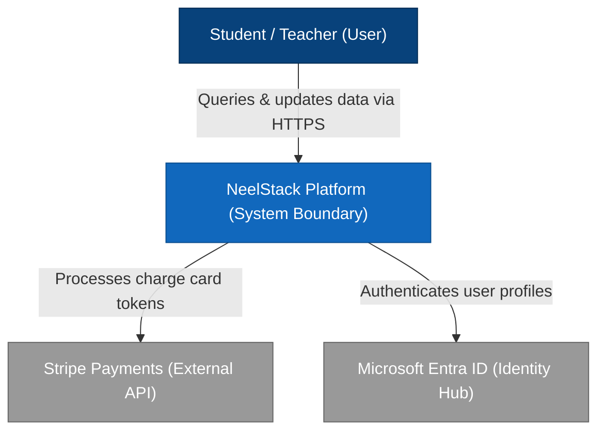

# NES-1400 — C4 Context Diagrams

> **"Understand the big picture first. We model our high-level system boundaries, user personas, and external dependency paths using C4 Context Diagrams."**

---

# Executive Summary

To design and communicate complex software architectures effectively, we must establish a shared understanding of how our systems interact with users and external platforms.

Relying on ad-hoc drawings or detailed, low-level diagrams during initial reviews causes confusion.

We mandate the use of the **C4 Model** (Level 1: System Context) for all enterprise system designs.

This standard establishes our context diagram formats, user mappings, boundary parameters, and integration paths.

---

# Purpose

This standard defines:

- C4 Level 1 (System Context) Diagram Principles
- User Persona Interactions Mapping
- External System Dependency Boundaries
- Mermaid Diagram Layout Specifications

---

# C4 Context Diagram Specification

Context diagrams show the system as a "black box" in the center, surrounded by users and external dependencies:

---

# Design & Modeling Rules

Ensure standard styling and labels:

1. **Explicit Roles**: Describe who the user is (e.g. "School Registrar") and their primary goal (e.g. "Manages class timetables").
2. **Clear Protocol Labels**: Every relationship line must clearly document the protocol and type of data exchanged (e.g. "HTTPS / JSON", "gRPC / Protobuf").
3. **No Internal Detail**: Context diagrams must not show internal databases, services, or server nodes. Those belong in Level 2 (Container) diagrams.

---

# Anti-Patterns

❌ **Mixing Levels**: Including internal databases or specific microservices in a System Context diagram, cluttering the view.

❌ **Unlabeled Connections**: Drawing lines between users and systems without labeling the protocols or data actions.

❌ **Excluding External Services**: Omitting key external dependencies (like payment gateways or identity managers) from the context map.

---

# Production Checklist

- [ ] System Context diagrams conform to C4 specifications.
- [ ] User personas and roles are clearly documented.
- [ ] External system dependencies are represented.
- [ ] Communication protocol labels are active.
- [ ] Diagram source files are checked into the repository.

---

# Success Criteria

The C4 Context Diagram standard is successful when:
- Product managers and developers share a common understanding of system boundaries.
- New engineers can identify core integrations within 5 minutes of review.
- Diagram models map directly to active platform gateways.

---

# Document Status

**Document:** NES-1400 — C4 Context Diagrams
**Version:** 1.0.0
**Status:** Ready for Review
**Next Document:** **NES-1401 — C4 Container Diagrams.md**
