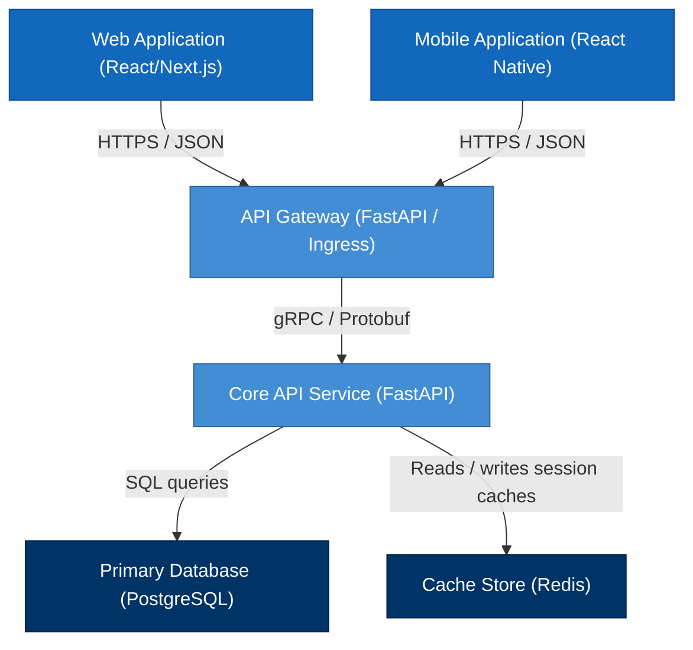

# NES-1401 — C4 Container Diagrams

> **"Deconstruct the system. We model our applications, microservices, databases, and client interfaces using C4 Container Diagrams."**

---

# Executive Summary

To coordinate development tasks across multiple frontend and backend engineering teams, we must understand the high-level software components (containers) that compose our platform.

If we dive straight into code implementation without mapping application runtimes, data stores, or cache layers, integration gaps and configuration mismatches will emerge.

We mandate the use of **C4 Container Diagrams** (Level 2) for all system designs.

This standard establishes our container modeling rules, runtime specifications, database definitions, and API channel representations.

---

# Purpose

This standard defines:

- C4 Level 2 (Container) Diagram Principles
- Frontend vs. Backend Microservice Mappings
- Database and Cache Layers Definitions
- Communication Protocols and Network Segments

---

# C4 Container Diagram Specification

Container diagrams map the executable applications, databases, and interfaces within our system boundary:

---

# Modeling & Design Rules

Ensure standard terminology and layouts:

1. **Containers are Executable Runtimes**: A container is any independently deployable service, script, backend API, or database instance (not just a Docker container).
2. **Clear Technology Labels**: Every container box must specify the primary technology stack used (e.g. "React/Next.js", "FastAPI / Python", "PostgreSQL").
3. **Explicit Connection Routing**: Label connection lines with the protocol and format (e.g. "HTTPS / JSON", "gRPC / Protobuf", "TCP / TLS").

---

# Anti-Patterns

❌ **Mixing Components and Containers**: Showing class structures, specific controller files, or internal modules in a container diagram.

❌ **Excluding Database Runtimes**: Representing the backend API and database as a single block, masking database routing boundaries.

❌ **Omitting API Gateways**: Routing client browsers directly to backend database APIs without representing gateway filters.

---

# Production Checklist

- [ ] Container diagrams conform to C4 Level 2 specifications.
- [ ] Executable runtimes specify their technology stack.
- [ ] Database and caching layers are represented.
- [ ] Connection lines include protocol and formatting labels.
- [ ] Diagram source files are version-controlled in the repository.

---

# Success Criteria

The C4 Container Diagram standard is successful when:
- Engineering teams identify database routing and API boundaries.
- Integration pathways map directly to Kubernetes ingress configurations.
- Developers can determine where to implement new microservice endpoints.

---

# Document Status

**Document:** NES-1401 — C4 Container Diagrams
**Version:** 1.0.0
**Status:** Ready for Review
**Next Document:** **NES-1402 — C4 Component Diagrams.md**
