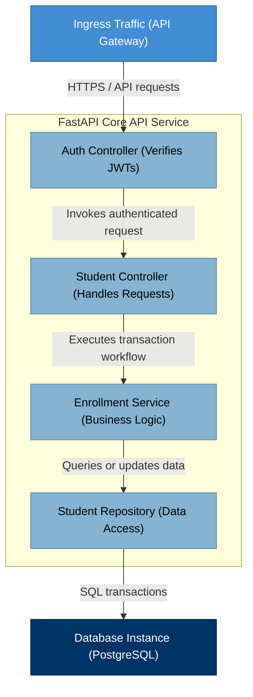

# NES-1402 — C4 Component Diagrams

> **"Deconstruct the container. We model our internal service layers, controller modules, repositories, and authentication checkers using C4 Component Diagrams."**

---

# Executive Summary

To help developers write modular, clean code inside a specific microservice or application, they must understand how internal modules interact with each other.

Without mapping service boundaries, database repositories, or controllers, internal components will become tightly coupled, making the codebase difficult to refactor.

We mandate the use of **C4 Component Diagrams** (Level 3) for all complex services.

This standard establishes our component modeling rules, layer interactions, and interface definitions.

---

# Purpose

This standard defines:

- C4 Level 3 (Component) Diagram Principles
- Controller, Service, and Repository Mappings
- Dependency Injection Boundaries
- Code Modularity and Testing Verification

---

# C4 Component Diagram Specification

Component diagrams map the internal code blocks and dependency injection chains within a single runtime container:

---

# Modeling & Design Rules

Ensure standard styling and labels:

1. **Components are Internal Code Modules**: A component is an assembly of source code blocks (classes, interfaces, controllers) running inside the same memory process.
2. **Represent Clean Layer Boundaries**: Group components visually into logical layers (Controller, Service, Repository) matching Clean Architecture rules.
3. **Map Dependencies Explicitly**: Show which components depend on or invoke others, detailing function call types or direct dependencies.

---

# Anti-Patterns

❌ **Representing Remote Microservices**: Mapping external network-isolated services as components inside the target container boundary.

❌ **Excluding Data Repository Layers**: Connecting controllers directly to database instances, bypassing service logic and repository abstractions.

❌ **Overcomplicating the Map**: Representing every single helper helper file, model class, or utility function, making the diagram unreadable.

---

# Production Checklist

- [ ] Component diagrams conform to C4 Level 3 specifications.
- [ ] Code modules are grouped into logical architectural layers.
- [ ] Dependency injection boundaries are mapped.
- [ ] Connection lines define internal function invocations.
- [ ] Diagram source files are version-controlled in the repository.

---

# Success Criteria

The C4 Component Diagram standard is successful when:
- Developers can identify where to implement new business logic.
- Modular code boundaries support independent component unit testing.
- Reviewers can evaluate dependency rules during pull request reviews.

---

# Document Status

**Document:** NES-1402 — C4 Component Diagrams
**Version:** 1.0.0
**Status:** Ready for Review
**Next Document:** **NES-1403 — C4 Code Diagrams.md**
