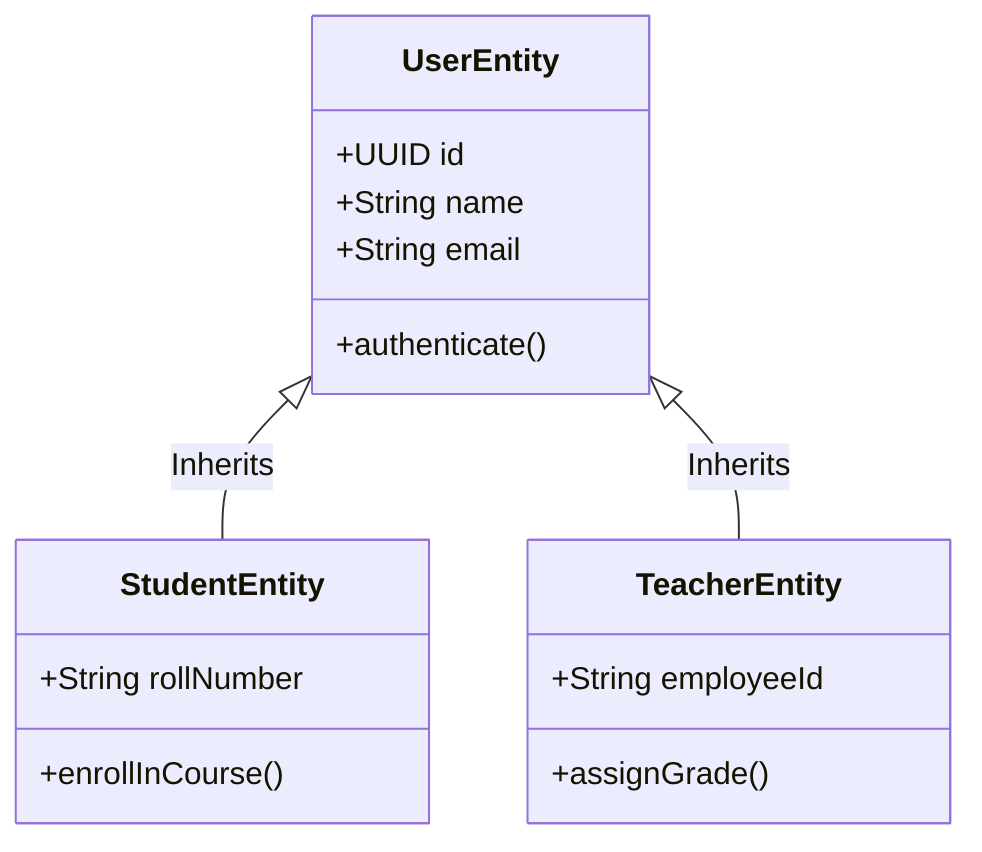

# NES-1403 — C4 Code Diagrams

> **"Code diagrams show structural relationships. We map class relationships, inheritance paths, and interface implementations using C4 Code Diagrams."**

---

# Executive Summary

To write modular, clean code inside our core services, developers must understand the relationships between different classes, data entities, and interfaces.

If developers implement new classes without mapping inheritance paths or dependency relationships, code duplication and runtime issues can occur.

We use **C4 Code Diagrams** (Level 4) to detail critical class structures.

This standard establishes our coding models, class mapping rules, and interface representation guidelines.

---

# Purpose

This standard defines:

- C4 Level 4 (Code) Diagram Principles
- Entity Class and Model Mapping Rules
- Interface Implementations and Inheritance
- Code Integrity and Structuring

---

# C4 Code Diagram Specification

Code diagrams map the internal class structures and inheritance relationships within a specific component:

---

# Modeling & Design Rules

Ensure standard styling and notations:

1. **Focus on Core Structures**: Level 4 diagrams must only be generated for complex domains, custom state machines, or key pattern engines.
2. **Explicit Member Types**: Document public methods (`+`) and private fields (`-`) to represent component interfaces accurately.
3. **Use GFM Syntax**: Generate diagrams using clean GitHub Flavored Markdown (GFM) class diagram syntax.

---

# Anti-Patterns

❌ **Mapping the Entire Repository**: Attempting to generate a Class Diagram for every file in the codebase, creating an unreadable wall of relationships.

❌ **Excluding Type Signatures**: Listing fields or methods without parameter types or return values.

❌ **Tight Coupling of Independent Domains**: Diagramming connections between unrelated business domains, violating DDD boundaries.

---

# Production Checklist

- [ ] Code diagrams conform to C4 Level 4 specifications.
- [ ] Core class properties and methods are documented.
- [ ] Inheritance and interface relationships are mapped.
- [ ] Diagram source files are version-controlled in the repository.
- [ ] Model designs align with schema schemas.

---

# Success Criteria

The C4 Code Diagram standard is successful when:
- Developers can implement code structures matching designs.
- Structural regressions are prevented during code refactoring.
- Code review times are reduced through clear class definitions.

---

# Document Status

**Document:** NES-1403 — C4 Code Diagrams
**Version:** 1.0.0
**Status:** Ready for Review
**Next Document:** **NES-1404 — UML Class Diagrams.md**
