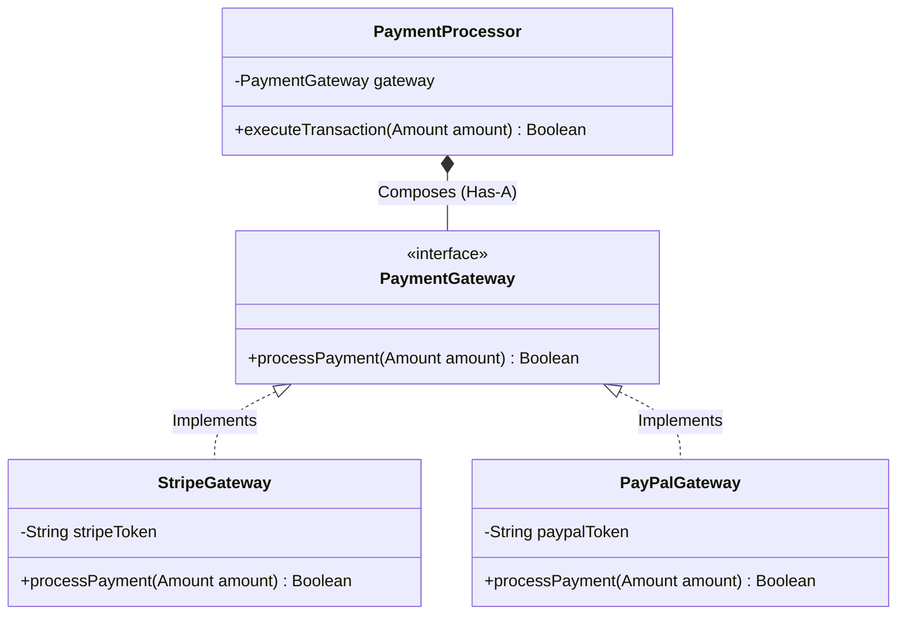

# NES-1404 — UML Class Diagrams

> **"Abstractions guide implementation. We design object-oriented relationships, design patterns, composition, and aggregation structures using UML Class Diagrams."**

---

# Executive Summary

To build robust, maintainable systems, we must follow object-oriented design principles and standard design patterns.

If developers write code without mapping inheritance, interfaces, composition, or aggregation relationships, code duplication and fragile systems will emerge.

We mandate the use of **UML Class Diagrams** to document design patterns and object relationships.

This standard establishes our class notations, relationship formats, visibility parameters, and inheritance maps.

---

# Purpose

This standard defines:

- UML Class Notations (Fields, Methods, Visibility)
- Relationship Indicators (Association, Aggregation, Composition, Inheritance)
- Design Pattern Implementations (Factory, Repository, Strategy)
- Mermaid Class Diagram Specifications

---

# UML Class Diagram Specification

UML Class diagrams map the relationships between classes, interfaces, and implementations:

---

# Design & Modeling Rules

Ensure standard styling and notations:

1. **Clear Class Compartments**: Represent class names, properties, and methods in distinct sections.
2. **Explicit Visibility Modifiers**:
   - `+` Public
   - `-` Private
   - `#` Protected
3. **Use Standard Relationship Indicators**: Use correct arrow directions for implementation (`<|..`), inheritance (`<|--`), composition (`*--`), and association (`-->`).

---

# Anti-Patterns

❌ **Omitting Cardinality**: Failing to document relationship counts (e.g. 1-to-many, 1-to-1) in associations, making relational limits ambiguous.

❌ **Excluding Interface Flags**: Failing to label interfaces with `<<interface>>` tags, confusing them with standard class structures.

❌ **Violating SOLID Principles**: Designing diagrams that show massive classes with multiple responsibilities, violating single-responsibility rules.

---

# Production Checklist

- [ ] UML Class diagrams conform to standard notations.
- [ ] Visibility modifiers are applied to all fields and methods.
- [ ] Relationship indicators use correct arrow directions.
- [ ] Interfaces are explicitly labeled.
- [ ] Diagram source files are version-controlled in the repository.

---

# Success Criteria

The UML Class Diagram standard is successful when:
- Developers implement object structures matching design specifications.
- Structural regressions are prevented during code refactoring.
- Code review times are reduced through clear class definitions.

---

# Document Status

**Document:** NES-1404 — UML Class Diagrams
**Version:** 1.0.0
**Status:** Ready for Review
**Next Document:** **NES-1405 — UML Sequence Diagrams.md**
