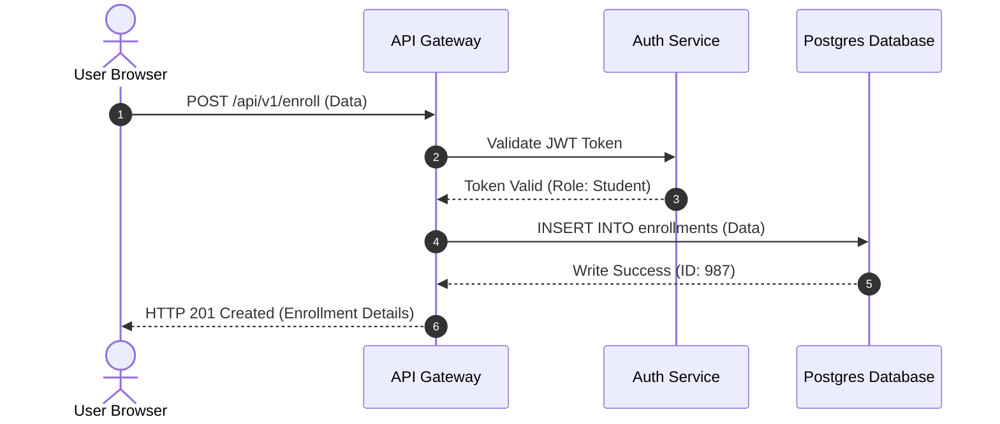

# NES-1405 — UML Sequence Diagrams

> **"Flow defines execution. We model our API calls, transaction processing flows, and asynchronous messaging sequences using UML Sequence Diagrams."**

---

# Executive Summary

To build and integrate complex APIs and asynchronous message systems, developers must understand the exact sequence and timing of events across components.

If developers implement systems without documenting call ordering, timeouts, or fallback processes, integration gaps and deadlock failures will emerge.

We mandate the use of **UML Sequence Diagrams** to document process flows.

This standard establishes our sequence formatting rules, actor and lifeline representations, synchronous/asynchronous indicators, and loop/alt logic blocks.

---

# Purpose

This standard defines:

- UML Sequence Diagram Notations
- Actor and Lifeline Definitions
- Synchronous and Asynchronous Call Mappings
- Alternatives (if/else) and Loop Blocks
- Mermaid Sequence Diagram Specifications

---

# UML Sequence Diagram Specification

UML Sequence diagrams map the chronological execution of calls across system components:

---

# Design & Modeling Rules

Ensure standard notations and configurations:

1. **Autonumbering**: Enable autonumbering to track sequence execution steps.
2. **Lifelines & Actors**: Clearly declare actors (users/external clients) and internal lifelines (microservices, databases) at the top of the diagram.
3. **Represent Return Values**: Ensure synchronous calls have corresponding return lines (dashed lines) representing variables returned.

---

# Anti-Patterns

❌ **Skipping Return Pathways**: Documenting requests without showing return flows, making response variables ambiguous.

❌ **Exposing Low-level Code Iterations**: Mapping low-level code actions (e.g. loops inside functions), which should be documented in unit tests rather than sequence maps.

❌ **Omitting Fail Scenarios**: Documenting only successful paths ("happy paths") while ignoring timeouts, validations, or fallback routes.

---

# Production Checklist

- [ ] Sequence diagrams conform to UML specifications.
- [ ] Steps use active autonumbering.
- [ ] Return lines are mapped for all synchronous calls.
- [ ] Fail scenarios (timeouts, validation failures) are documented.
- [ ] Diagram source files are version-controlled in the repository.

---

# Success Criteria

The UML Sequence Diagram standard is successful when:
- Developers implement APIs matching process sequences.
- System timeouts and retry mechanisms are defined.
- Core transaction pathways are documented and reviewable.

---

# Document Status

**Document:** NES-1405 — UML Sequence Diagrams
**Version:** 1.0.0
**Status:** Ready for Review
**Next Document:** **NES-1406 — Deployment Diagrams.md**
