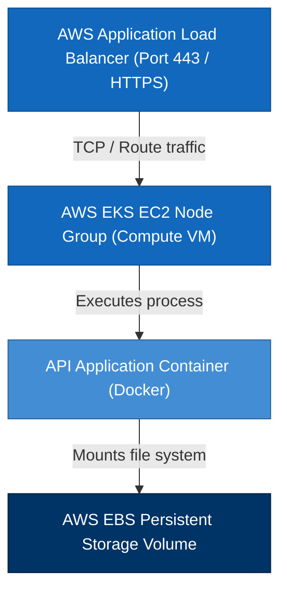

# NES-1406 — Deployment Diagrams

> **"Hosting requires physical models. We diagram our compute nodes, physical routing, storage mapping, and load balancer configurations using Deployment Diagrams."**

---

# Executive Summary

To deploy and maintain software systems across multi-cloud and on-premise infrastructure, operations teams must understand how applications map to physical hardware or cloud instances.

If we deploy code without documenting node hosting architectures, port allocations, storage configurations, or load balancing points, provisioning errors and configuration drift will emerge.

We mandate the use of **Deployment Diagrams** to guide environment management.

This standard establishes our node definitions, port mappings, protocol boundaries, and storage attachments.

---

# Purpose

This standard defines:

- Deployment Diagram Principles
- Physical and Virtual Node Configurations
- Network Port and Protocol Definitions
- Storage Attachments (EBS, S3)
- Cloud Infrastructure Mappings

---

# Deployment Diagram Specification

Deployment diagrams map the execution environment, nodes, and physical storage:

---

# Design & Modeling Rules

Ensure standard styling and notations:

1. **Nodes are Physical or Virtual Hosts**: A node represents a compute instance (e.g. AWS EC2 VM, bare-metal server, device host).
2. **Document Network Ports**: Explicitly document network ports and protocol parameters on connection lines (e.g. "HTTPS / Port 443").
3. **Represent Storage Attachments**: Show where persistent storage volumes (e.g. EBS volumes, S3 buckets) attach to node containers.

---

# Anti-Patterns

❌ **Confusing Software and Hardware**: Drawing software components (e.g., classes or libraries) as nodes in a deployment diagram.

❌ **Omitting Network Protocols**: Drawing connection lines without documenting network protocols (e.g. TCP, HTTPS, gRPC) or port configurations.

❌ **Excluding Load Balancing Nodes**: Routing client applications directly to compute instances without representing the load balancers.

---

# Production Checklist

- [ ] Deployment diagrams conform to standard specifications.
- [ ] Nodes represent physical or virtual hosts.
- [ ] Network ports and protocols are labeled.
- [ ] Storage attachments are documented.
- [ ] Diagram source files are version-controlled in the repository.

---

# Success Criteria

The Deployment Diagram standard is successful when:
- Operations teams can provision environments matching design specifications.
- Network routing and port configurations are documented.
- Infrastructure provisioning errors are minimized.

---

# Document Status

**Document:** NES-1406 — Deployment Diagrams
**Version:** 1.0.0
**Status:** Ready for Review
**Next Document:** **NES-1407 — Kubernetes Architecture.md**
