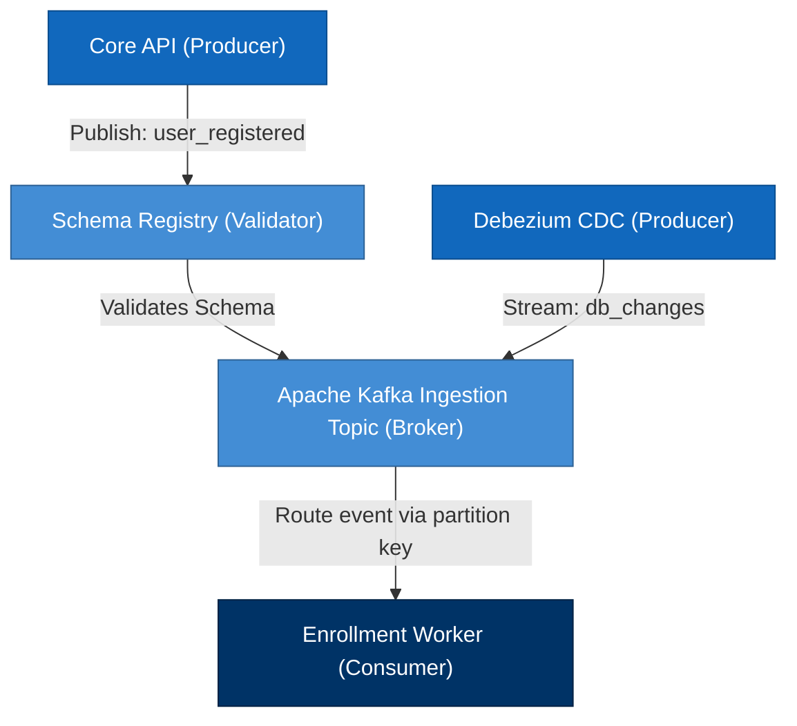

# NES-1410 — Event Flow Diagrams

> **"Event pathways define streaming architecture. We model our asynchronous Kafka topics, schema registries, and consumer group routing using Event Flow Diagrams."**

---

# Executive Summary

To coordinate development tasks across multiple event-driven microservices, engineering teams must visualize how events flow from producers, through brokers, and out to downstream consumers.

If we deploy streaming pipelines without documenting event pathways, key topic partition mappings, or schema validations, consumer lag and processing drops will emerge.

We mandate the use of **Event Flow Diagrams** to guide development.

This standard establishes our event routing representations, topic definitions, schema validations, and consumer boundaries.

---

# Purpose

This standard defines:

- Event Flow Diagram Principles
- Ingestion, Broker, and Consumer Group Representations
- Schema Registry Validation Gates
- Topic Partitioning and Key Mappings

---

# Event Flow Diagram Specification

Event Flow diagrams map the runtime execution of asynchronous streams:

---

# Design & Modeling Rules

Ensure standard terminology and layouts:

1. **Clearly Label Event Names**: Connection lines must document the exact event name and format (e.g. `Publish: user_registered / Avro`).
2. **Represent Schema Validation Gates**: Map the Schema Registry as a gateway before events commit to broker topics.
3. **Document Partition Keys**: Explicitly document partition keys on routing lines to confirm sequential processing order (NES-1209).

---

# Anti-Patterns

❌ **Mixing Synchronous APIs**: Representing direct HTTP REST loops inside event-driven flow maps. REST belongs in sequence diagrams (NES-1405).

❌ **Omitting Partition Keys**: Drawing event streams without specifying the key used, causing out-of-order execution risk.

❌ **Excluding DLQ Routes**: Mapping event streams without showing dead-letter queue isolation routes for processing failures.

---

# Production Checklist

- [ ] Event Flow diagrams conform to standard specifications.
- [ ] Topic names match active naming schemas.
- [ ] Schema validation checkpoints are represented.
- [ ] Consumer group names are documented.
- [ ] Diagram source files are version-controlled in the repository.

---

# Success Criteria

The Event Flow Diagram standard is successful when:
- Engineering teams identify event dependencies and topic routings.
- Consumer lag indicators remain low during streaming operations.
- Outages or schema changes are audited successfully.

---

# Document Status

**Document:** NES-1410 — Event Flow Diagrams
**Version:** 1.0.0
**Status:** Ready for Review
**Next Document:** **NES-1411 — AI Agent Interaction Diagrams.md**
