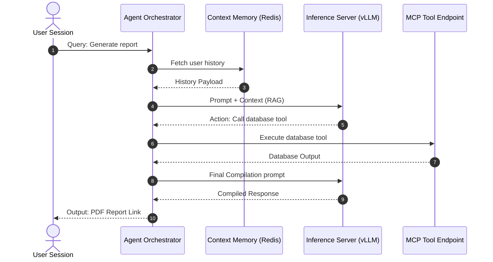

# NES-1411 — AI Agent Interaction Diagrams

> **"Agentic workflows require structured paths. We model our prompt templates, planning loops, agent memory buffers, and tool call executions using AI Agent Interaction Diagrams."**

---

# Executive Summary

To build and operate reliable AI agents that execute multi-step planning tasks, call backend APIs, and maintain session context, developers must visualize the interaction path between the user, the agent router, the LLM backend, and tool endpoints.

Without mapping these interaction boundaries, agent execution can run into infinite loops or leak data.

We mandate the use of **AI Agent Interaction Diagrams** to guide development.

This standard establishes our agent model formatting rules, planning loops, context buffers, and tool execution boundaries.

---

# Purpose

This standard defines:

- AI Agent Interaction Diagram Principles
- Agent Planning and Reasoning Loops Mappings
- Context Memory Buffers and Vector Embeddings Mappings
- Tool Call Execution Boundaries

---

# AI Agent Interaction Diagram Specification

Agent interaction diagrams map the chronological prompt evaluations, planning runs, and tool calls:

---

# Design & Modeling Rules

Ensure standard styling and notations:

1. **Explicit Prompt Mappings**: Chronological steps must clearly identify what is a system prompt request vs. user inputs.
2. **Represent Context Buffers**: Map memory checkpoints (e.g. database lookups, vector retrievals) to show how history is appended to LLM context windows.
3. **Trace Tool Calls**: Document tool calls explicitly, specifying input parameters and return schemas.

---

# Anti-Patterns

❌ **Direct User to LLM Access**: Routing client interfaces directly to LLM inference servers, bypassing the Agent Orchestrator and security guardrails (NES-1204).

❌ **Omitting Tool Return Schemas**: Showing agent tool call commands without documenting return paths, making agent behaviors ambiguous.

❌ **Excluding Memory Checkpoints**: Assuming agents run without context databases, causing stateless, disconnected user sessions.

---

# Production Checklist

- [ ] Agent interaction diagrams conform to standard specifications.
- [ ] Prompt templates are mapped.
- [ ] Context memory checkpoints are represented.
- [ ] Tool execution inputs and returns are documented.
- [ ] Diagram source files are version-controlled in the repository.

---

# Success Criteria

The AI Agent Interaction Diagram standard is successful when:
- Developers implement agentic logic matching planning structures.
- Infinite tool call loops are prevented through explicit logic gates.
- Agent session states remain consistent across API requests.

---

# Document Status

**Document:** NES-1411 — AI Agent Interaction Diagrams
**Version:** 1.0.0
**Status:** Ready for Review
**Next Document:** **NES-1412 — MCP Communication Diagrams.md**
