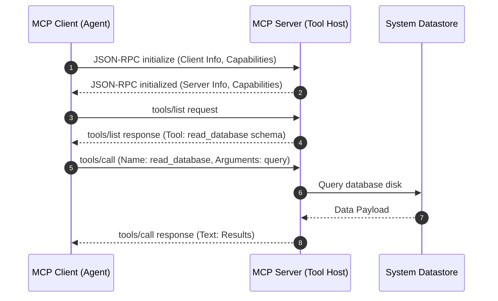

# NES-1412 — MCP Communication Diagrams

> **"Protocol boundaries define agent capability. We model our Model Context Protocol (MCP) handshakes, dynamically registered tools, and context listings using MCP Communication Diagrams."**

---

# Executive Summary

To connect LLM orchestration clients (e.g. Cursor, custom agent portals) with local or remote tool servers using the Model Context Protocol (MCP), we must enforce a structured message flow.

If we integrate MCP servers without documenting dynamic resource listings, tool schemas, or JSON-RPC call sequences, connection drops and execution failures will emerge.

We mandate the use of **MCP Communication Diagrams** to guide development.

This standard establishes our MCP handshakes, dynamic resource lists, dynamic prompts updates, and tool call execution sequences.

---

# Purpose

This standard defines:

- MCP Communication Diagram Principles
- Client-Server Handshake and Capabilities Exchange Mappings
- Dynamic Resource and Prompts Listing Mappings
- JSON-RPC Tool Call Execution Pathways

---

# MCP Communication Diagram Specification

MCP diagrams map the chronological JSON-RPC handshakes, capabilities discovery, and tool executions:

---

# Design & Modeling Rules

Ensure standard protocol mappings and configurations:

1. **Map JSON-RPC Payloads**: Document JSON-RPC request and response names (e.g., `tools/list`, `resources/read`) on sequence lines.
2. **Represent Capabilities Handshake**: Always represent the initial capability check step (`initialize` / `initialized`) to confirm protocol version alignments.
3. **Trace Local vs. Remote Transports**: Specify the transport channel used (e.g. Stdio for local integrations, SSE/HTTP for remote integrations) in diagram metadata.

---

# Anti-Patterns

❌ **Direct Tool Executions without Listing**: Invoking tools directly from clients without running discovery queries first, risking schema mismatches.

❌ **Exposing Access Credentials in Payloads**: Passing secret auth parameters inside JSON-RPC arguments instead of utilizing backend server variables.

❌ **Omitting Handshake Procedures**: Drawing tool sequences starting directly at execution steps without mapping initialization handshakes, hiding setup steps.

---

# Production Checklist

- [ ] MCP diagrams conform to Model Context Protocol specifications.
- [ ] JSON-RPC command names are labeled.
- [ ] Initial handshake validations are represented.
- [ ] Stdio vs. SSE transports are documented.
- [ ] Diagram source files are version-controlled in the repository.

---

# Success Criteria

The MCP Communication Diagram standard is successful when:
- Developers implement MCP servers matching protocol specifications.
- Dynamic tool discovery functions without integration drops.
- Error codes conform to standard JSON-RPC specifications.

---

# Document Status

**Document:** NES-1412 — MCP Communication Diagrams
**Version:** 1.0.0
**Status:** Ready for Review
**Next Document:** **NES-1413 — Network Topology.md**
