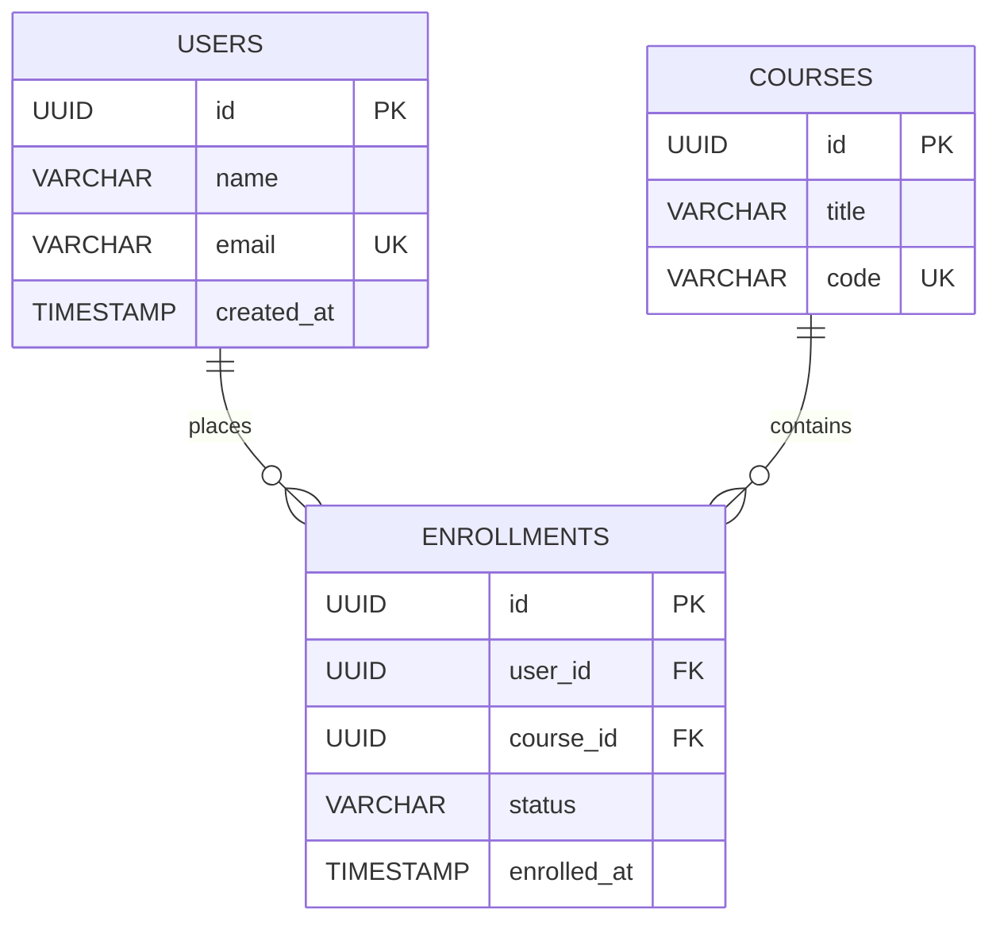

# NES-1418 — Database ERDs

> **"Data models define platform capabilities. We design table relations, primary/foreign keys, and index placements using Entity-Relationship Diagrams (ERDs)."**

---

# Executive Summary

To operate a highly available, transactionally consistent database system (PostgreSQL), we must maintain clear models of table schemas and relationships.

If developers modify tables or add new foreign keys without updating entity maps, database integrity violations and slow query locks will occur.

We mandate the use of **Entity-Relationship Diagrams (ERDs)** to guide schema upgrades.

This standard establishes our table representations, primary/foreign key definitions, relationship notations, and index checkpoints.

---

# Purpose

This standard defines:

- ERD Notation Specifications (Crow's Foot Notation)
- Primary Key (PK) and Foreign Key (FK) Configurations
- One-to-Many, Many-to-Many Table Mappings
- Index Mapping rules for High-Performance Queries

---

# Database ERD Specification

Database ERD maps table structures, data types, and primary-foreign key linkages:

---

# Design & Modeling Rules

Ensure standard styling and structural constraints:

1. **UUID as Primary Key**: All tables must use UUIDs (`id PK`) as their primary keys to support multi-tenant replication.
2. **Explicit Foreign Key Constraints**: Map foreign keys explicitly to target tables (`user_id FK`), enforcing referential integrity.
3. **Use Crow's Foot Notation**: Use standard Crow's Foot notations (`||--o{`) to represent relationships.

---

# High-Performance Index Mappings

Protect databases from slow query scans:

- **Foreign Key Indexes**: Always create indexes on foreign key columns (e.g. `idx_enrollments_user_id`) to accelerate join queries.
- **Unique Constraints**: Configure unique constraints (`UK`) on business identifier columns (e.g. user emails, course codes).

---

# Anti-Patterns

❌ **Wildcard Primary Keys**: Using sequential integers (BigInt) as primary keys, which complicates database sharding and exports.

❌ **Omitting Referential Integrity**: Storing relational IDs without configuring foreign key constraints, leading to orphaned rows.

❌ **Excluding Indexes on FKs**: Querying heavy joins across tables without indexes on foreign keys, causing table locks.

---

# Production Checklist

- [ ] Database schemas conform to the ERD specifications.
- [ ] Tables use UUIDs as primary keys.
- [ ] Foreign keys use referential integrity checks.
- [ ] Indexes are configured on foreign key columns.
- [ ] Diagram source files are version-controlled in the repository.

---

# Success Criteria

The Database ERD standard is successful when:
- Database upgrades run successfully via Alembic migrations.
- Data queries maintain low CPU usage rates under concurrent loads.
- Data integrity violations and orphaned rows are eliminated.

---

# Document Status

**Document:** NES-1418 — Database ERDs
**Version:** 1.0.0
**Status:** Ready for Review
**Next Document:** **NES-1419 — Domain Context Maps.md**
