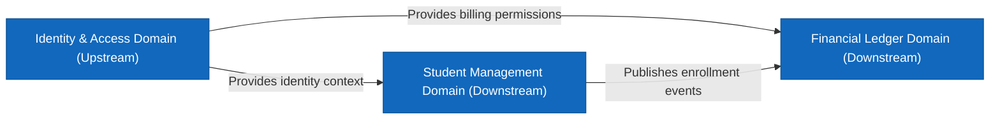

# NES-1419 — Domain Context Maps

> **"Domain boundaries define software modularity. We map our bounded contexts, ubiquitous language terms, and context relationships using Domain Context Maps."**

---

# Executive Summary

In a large enterprise system, developers from different divisions must share a clear definition of business entities and their boundaries.

If teams implement overlapping features without clear domain contexts, duplicate databases and tight couplings will emerge.

We mandate the use of **Domain Context Maps** (Domain-Driven Design) to guide module development.

This standard establishes our bounded contexts, ubiquitous language registries, and context relationship boundaries.

---

# Purpose

This standard defines:

- Domain Context Map Principles
- Bounded Context and Domain Boundaries Definitions
- Ubiquitous Language Registry Guidelines
- Context Relationship Mappings (Upstream / Downstream)

---

# Domain Context Map Specification

Domain Context maps visualize the relationships and data exchange boundaries between distinct business domains:

---

# Bounded Context Rules & Relationships

Maintain clean separation between contexts:

- **Bounded Context Definition**: A bounded context sets explicit boundaries around a domain model. Inside this boundary, all terms (ubiquitous language) have a single, consistent meaning.
- **Context Relationships**: Define relationship models between contexts:
  - **Shared Kernel**: Shared data schemas used by multiple domains.
  - **Upstream / Downstream**: Upstream domains publish changes that downstream domains consume.

---

# Ubiquitous Language Registry

Avoid terminology confusion across domains:

- **Unified Vocabulary**: Compile a ubiquitous language dictionary for each domain. Define core entities explicitly (e.g., what "Student" means inside the SaaS domain vs. "User" in the Identity domain).
- **Enforcement**: Code classes, variable names, database columns, and API routes must use terms from the Ubiquitous Language Registry.

---

# Anti-Patterns

❌ **Overlapping Domain Models**: Creating a single `User` entity that contains billing methods, medical details, and course grades, violating boundary rules.

❌ **Excluding Domain Ownership**: Leaving domain boundaries undefined, allowing teams to modify databases outside their context.

❌ **Ambiguous Terms**: Using different terms for the same business entity across codebases.

---

# Production Checklist

- [ ] Domain Context maps conform to DDD standards.
- [ ] Bounded contexts are documented.
- [ ] Upstream/Downstream relationships are mapped.
- [ ] Ubiquitous Language Registry is published.
- [ ] Diagram source files are version-controlled in the repository.

---

# Success Criteria

The Domain Context Map standard is successful when:
- 100% of microservice layouts align with domain boundaries.
- Code variables and API routes use consistent domain terminology.
- Integration dependencies map cleanly to domain boundaries.

---

# Document Status

**Document:** NES-1419 — Domain Context Maps
**Version:** 1.0.0
**Status:** Ready for Review
**Next Document:** **NES-001 — Vision.md**
