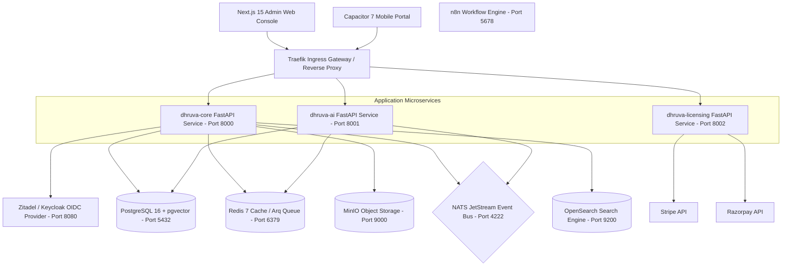

# DhruvaOS — System Architecture & Features Overview

DhruvaOS is a next-generation, AI-first, multi-tenant Enterprise Operating System Platform designed to host and scale reusable multi-industry SaaS modules (such as Education, Pharma, Retail, Hospital, CRM, HRMS, Accounting, etc.) under a single unified, secure, and globally scalable platform.

---

## 🏛️ System Architecture Topology

DhruvaOS is structured as a modern **Turborepo** monorepo using **pnpm workspaces** under [neelstack-foundation](file:///d:/NeelStack/neelstack-foundation). The architecture separates presentation, orchestration, service logic, data persistence, and background tasks:

### 1. Multi-Tenant Context Routing & Multi-Industry Catalogues
DhruvaOS operates on a flexible multi-tenant layout supporting:
*   **Multi-Industry Catalogues**: Onboarding processes accept an `industry` parameter (e.g. `education` or `pharma`) resolving default branding metadata and module suites dynamically from the [catalogues registry](file:///d:/NeelStack/neelstack-foundation/services/core/src/app/platform/api/admin/catalogues.py).
*   **SaaS Tier (Schema-per-tenant)**: Tenant isolation is achieved dynamically via a custom database middleware. The system intercepts incoming requests, resolves the tenant context from the host headers or JWT claims, and routes database operations to the tenant's isolated schema using Postgres policies or schema-isolated search paths.
*   **Compliance & Enterprise Tiers**: Support for logical database isolation (database-per-tenant) and dedicated postgres compute instances based on corporate SLAs.
*   **Platform Kernel**: Thread-safe `TenantContext` using Python's native `ContextVar` to secure context boundaries across concurrent asynchronous task loops.

### 2. Dynamic Plugin Discovery
FastAPI services do not import modules statically. Instead, [PluginLoader](file:///d:/NeelStack/neelstack-foundation/services/core/src/app/kernel/plugin_loader.py) dynamically scans directory directories for `module.yaml` manifests at service boot, loading routes, permissions, events produced/consumed, AI tools, and sidebar layouts dynamically.

---

## 🚀 Core Technology Stack & Microservices

### 1. Application Microservices

*   **[dhruva-core](file:///d:/NeelStack/neelstack-foundation/services/core)**: Written in **Python 3.13** using **FastAPI**. It handles standard business operations, SQLAlchemy 2.0 async transactions, database migrations via Alembic, OIDC token validation, and multi-tenant schema isolation. Runs on port `8000`.
*   **[dhruva-ai](file:///d:/NeelStack/neelstack-foundation/services/ai)**: Written in **Python 3.13** using **FastAPI**. Connects to LLM providers (Gemini, OpenAI), runs semantic retrieval queries via `pgvector` database pools, parses unstructured queries using the Capability Planner, and hosts server-sent event (SSE) chat streams. Runs on port `8001`.
*   **[dhruva-licensing](file:///d:/NeelStack/neelstack-foundation/services/licensing)**: Written in **Python 3.13** using **FastAPI**. Validates subscription license keys (prefixed with `NSL-`) for self-hosted instances on startup, and creates billing checkout sessions via Stripe (for USD payments) and Razorpay (for INR payments). Runs on port `8002`.

### 2. Client Portals

*   **[Admin Web Console (apps/web)](file:///d:/NeelStack/neelstack-foundation/apps/web)**: Built with **Next.js 15 (App Router)** and **React 19**. It functions as the central desktop portal for school administrators, registrars, and accountants.
*   **[Mobile Portal (apps/mobile)](file:///d:/NeelStack/neelstack-foundation/apps/mobile)**: Built with **React 19**, **Vite**, and **Capacitor 7** for cross-platform distribution (Android, iOS, PWA). Implements local offline storage, push notifications, custom schema deep linking, and device biometric credential verification.

### 3. Shared Workspace Packages

*   **[shared](file:///d:/NeelStack/neelstack-foundation/packages/shared)**: Core helper configurations and log formatting utilities.
*   **[ui](file:///d:/NeelStack/neelstack-foundation/packages/ui)**: Shared React UI design system (Button, Modal, StatCard, SkeletonLoader).
*   **[validation](file:///d:/NeelStack/neelstack-foundation/packages/validation)**: Common Zod schemas shared across client and server.
*   **[types](file:///d:/NeelStack/neelstack-foundation/packages/types)**: Shared TypeScript definitions.

### 4. Infrastructure Services & Local Container Footprint

Defined inside [docker-compose.dev.yml](file:///d:/NeelStack/neelstack-foundation/infrastructure/docker/docker-compose.dev.yml) and cloud-native [terraform/main.tf](file:///d:/NeelStack/internal-infrastructure/terraform/compute.tf), the stack is optimized to run exactly **11 local containers** to prevent resource exhaustion and simplify development, while using cloud-managed resources in production:

*   **Database**: PostgreSQL 16 (with `pgvector` extension) manages core schema relationships, multi-tenant tables, and AI vector embeddings.
*   **Cache & Queue**: Redis 7 handles distributed key rate limiting, session storage, and `Arq` asynchronous background workers.
*   **Message Broker**: NATS + JetStream handles event-driven inter-service messaging, pub/sub topics, and log streaming pipelines. (NATS 2.10-alpine is enabled, while legacy RabbitMQ hooks are disabled).
*   **Object Storage**: MinIO (local dev) / AWS S3 (production) holds uploaded documents, student profiles, and school branding resources.
*   **SSO / Identity Provider**: Zitadel (default v2.71) and Keycloak are supported via standard OpenID Connect (OIDC) JWT validation protocols and SAML federation.
*   **Workflows**: n8n visual automations are integrated to trigger events (e.g. notifications on payment/admission approvals) via secure API calls.
*   **Observability**: Loki collects logs, Prometheus pulls telemetry indicators, and Grafana maps dashboards (e.g. `api-overview.json`) for administrators.
*   **Search**: OpenSearch is present in dev profiles but **disabled by default** to save memory. In Phase 1, the core API uses native **PostgreSQL Full-Text Search (using the `pg_trgm` extension)**.
*   **Secrets & Credentials**: Managed via **AWS Secrets Manager** in production (fetching values via `boto3` client), falling back to local `.env` variables for development.

---

## 🛠️ Feature Modules (FastAPI Core)

All core modules are organized as isolated features under [services/core/src/app/modules](file:///d:/NeelStack/neelstack-foundation/services/core/src/app/modules). Each implements a Router → Service → Schema layout:

1.  **Accounts**: Manages financial charts, fee allocations, transactions ledger, and school balance sheets.
2.  **Admission**: Handles online applications, draft states, OCR-based document verification, class default allocation, and automated enrollment invoice generation.
3.  **Analytics**: Tracks institutional statistics, student counts, average scores, and attendance rates.
4.  **Attendance**: Registers daily student and staff logs. Integrates with biometric readers and generates bulk SMS/email alerts for absent students.
5.  **Auth**: Manages OIDC login configurations, JWT verification using local `PyJWKClient` certificates, and SAML 2.0 institutional federations.
6.  **Communication**: Runs noticeboards, triggers push notifications, emails, SMS notices, and synchronizes real-time updates.
7.  **Compliance**: Maps school operations to safety guidelines and state academic standards.
8.  **Examination**: Configures term/class grading schemas, marks entry sheets, report card layouts, and result publishing.
9.  **Hostel**: Controls hostel inventory, room bookings, warden logs, and mess fee structures.
10. **HR**: Manages employee profiles, hiring workflows, role hierarchies, and contracts.
11. **Leave**: Processes student and employee leave requests with multi-level approval hierarchies.
12. **Library**: Coordinates the book catalog, shelf codes, checkouts, due dates, and fine tracking.
13. **Payroll**: Generates monthly employee salaries, defines payroll templates, computes allowances/deductions, and exports payslips.
14. **School**: Manages institutional configurations, default profiles, class segments, sections, and subjects.
15. **Session**: Manages active academic years, semester configurations, and class terms.
16. **SLA**: Audits API responsiveness, request success metrics, and tenant uptime indicators.
17. **Student**: Central database of enrolled students, guardian profiles, addresses, and academic histories.
18. **Sync**: Handles database backup configurations, cloud replication tasks, and external legacy DB integrations.
19. **Transportation**: Tracks buses, route coordinates, driver assignments, and vehicle maintenance logs.
20. **WebSocket**: Runs WebSocket connections for real-time dashboard notifications.
21. **Pharma**: Manages medicines inventory, batch details, and expiry tracking for pharmaceutical environments.

---

## 🤖 AI Gateway Capabilities & Agents

The [dhruva-ai](file:///d:/NeelStack/neelstack-foundation/services/ai) service exposes specialized AI features organized under separate capabilities and multi-agent roles:

### 1. Model Providers & Routing
The gateway abstracts model integrations via a provider factory supporting:
*   **Google Generative AI**: Native Gemini SDK models for latency-effective responses.
*   **OpenAI**: Standard GPT model endpoints.
*   **Ollama**: Local container-hosted models (e.g., Llama, Mistral) for local developer profiles or offline deployments.

### 2. Gateway Capabilities
*   **RAG (Retrieval-Augmented Generation)**: Uses `pgvector` to run semantic context searches, indexing, and document chunk configs.
*   **Sentiment**: Scans student feedback and notice reactions for negative patterns or safety flags.
*   **Predict**: Employs mathematical models to predict student performance trends and dropout probabilities.
*   **Multimodal**: Handles image and document uploads (e.g. checking passport/ID scans during admissions).
*   **Governance & Policies**: Enforces strict spending budgets inside Redis (`budget:usage:<tenant_id>`). It triggers alerts at 80% usage and denies requests with a `402 Payment Required` exception at 100% budget.
*   **Guardrails**: Protects personal identifiers (PII) using Microsoft Presidio to mask names, phone numbers, and SSNs prior to LLM transit. Rejects prompt injections using similarity comparisons.

### 3. Multi-Agent System
The service defines four specialized AI agent models acting on the workspace context:
*   **Teacher Agent**: Answers curriculum questions, generates quiz formats, and drafts lesson structures.
*   **Class Teacher Agent**: Manages classroom-level queries, marks attendance lookups, and drafts report card remarks.
*   **Principal Agent**: Orchestrates school-wide policy reviews, checks staff workload parameters, and compiles compliance summaries.
*   **Director Agent**: Handles high-level financial questions, enrollment progress indices, and multi-school metrics.
*   **Consensus Engine**: Runs dual-agent pipelines (e.g., Academic vs. Policy reviews) concurrently to verify sensitive notices before publication.

### 4. AI Evaluation Framework
A dedicated evaluation suite resides in [eval/](file:///d:/NeelStack/neelstack-foundation/services/ai/src/app/eval/) to verify LLM execution characteristics:
*   `ab_test.py`: Validates variant completions against test criteria.
*   `model_benchmark.py`: Runs latency, token count, and cost benchmark comparisons.
*   `runner.py`: Orchestrates automated accuracy evaluations against structured test datasets.

---

## 📱 User Portal Features

### 1. Next.js Web Console
Organized under [apps/web/app/dashboard](file:///d:/NeelStack/neelstack-foundation/apps/web/app/dashboard), the dashboard exposes specific client modules:
*   **Accounts & Payroll**: Interfaces to track school fees, transactions, and download monthly payslips.
*   **Students & Admissions**: Registrar tools to approve admission drafts and view student details.
*   **HR & Leave**: Employee registry with staff rosters and leave approval panels.
*   **Attendance & Examinations**: Input grids to mark attendance and record grade points.

### 2. Capacitor Mobile Portal
Organized under [apps/mobile](file:///d:/NeelStack/neelstack-foundation/apps/mobile), the hybrid client portal provides:
*   **Client Routes**: Role-based access layouts (teacher, parent, student).
*   **Offline Support**: Utilizes Service Workers and Workbox to enable stale-while-revalidate data loading.
*   **Biometrics**: Incorporates device fingerprint/face authentication prompts.
*   **Deep Links**: Maps custom URI schemas (`dhruvaos://`) for smooth app transitions.

---

## 🛠️ DevOps & CI/CD Pipeline

The application delivery pipeline is managed via GitHub Actions in [.github/workflows/ci.yml](file:///d:/NeelStack/neelstack-foundation/.github/workflows/ci.yml) and deploys directly to AWS ECS Fargate:

1.  **Validation Stage**:
    *   **TypeScript/Linting**: Validates type safety and style constraints.
    *   **SAST Security**: Scans Python services for vulnerabilities using **Bandit**.
    *   **Dependency Audit**: Runs **pip-audit** (failing on high CVSS alerts) and npm audit scans.
    *   **Code Coverage**: Enforces Vitest and Pytest thresholds, failing the build if lines coverage drops below **70%** (frontend) or **80%** (backend core/AI services).
2.  **Deployment Stage**:
    *   Triggered on commits to `main` and `dev` branches.
    *   Compiles container images and pushes them to **Amazon ECR**.
    *   Updates active **AWS ECS Fargate Task Definitions** to trigger rolling container updates.

---

## 📐 Architecture Design Tradeoffs

*   **Modular Monolith Core**: Cross-cutting features (notifications, scheduling, files, auditing, templates, integrations) are modularized as standard Python modules inside [dhruva-core](file:///d:/NeelStack/neelstack-foundation/services/core) rather than separated into 10+ distinct microservices. This design choice maintains high developer velocity, avoids connection/port sprawl, and ensures local dev environments fit easily within local machine resources, while remaining scalable via ECS Fargate service instances.
